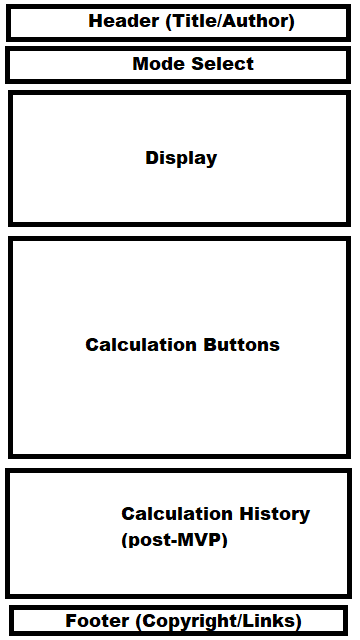
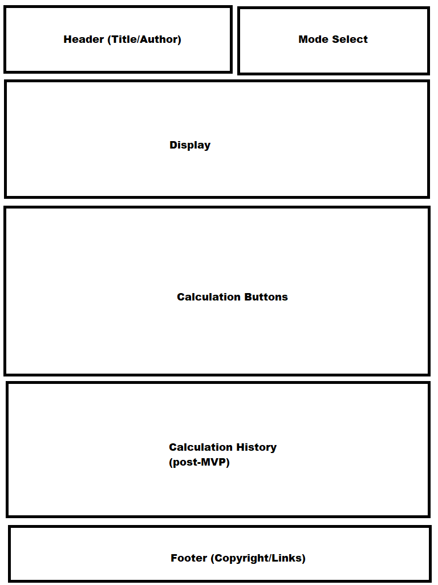
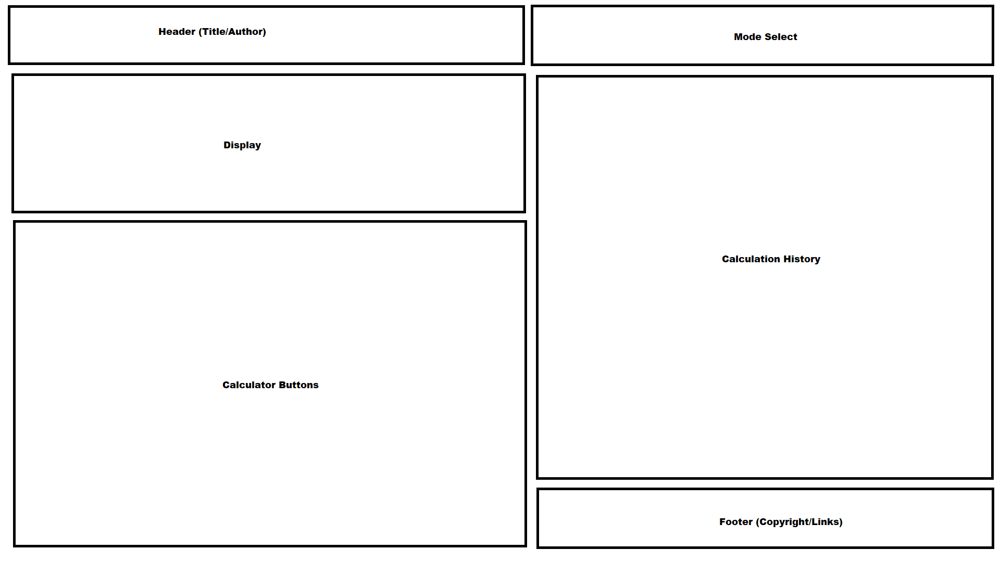
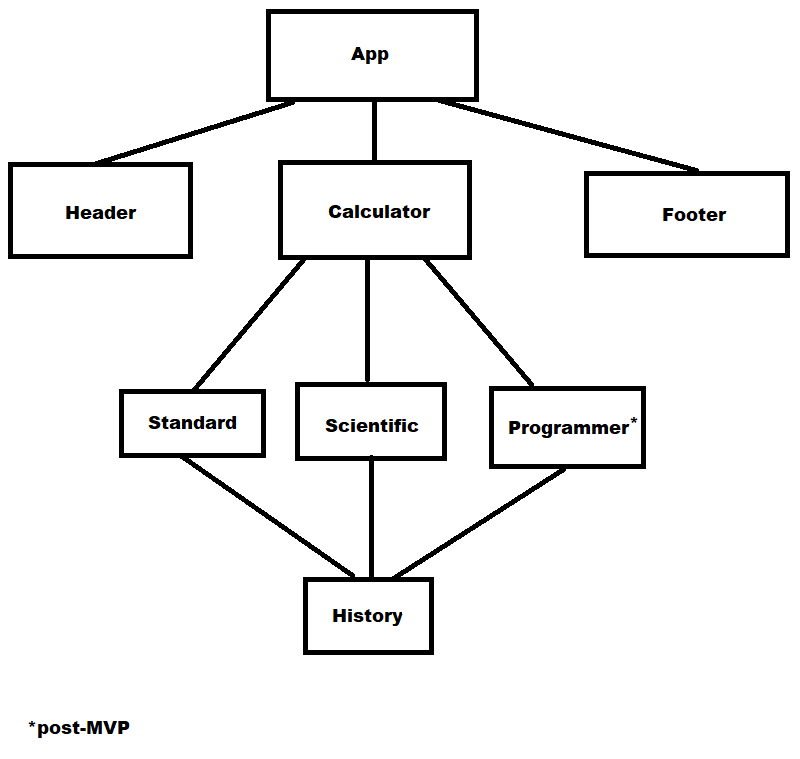

# General Assembly Project 2

## Neato Calculator

## Project Description

Using a calculator API with common functionality stored in Airtable, this app will be designed to perform all types of calculations. There will be multiple modes, including standard, scientific, and programming, and the history will keep track of all of your calculations.

## Wireframes

### Mobile (360x640)

### Tablet (768x1024)

### Desktop (1920x1080)

## Component Hierarchy

## API and Data Sample

[Math.js API](https://api.mathjs.org/)

The following response is given when this GET request is made: `GET http://api.mathjs.org/v4/?expr=2%2F3&precision=3`

`0.667`

#### MVP 

- Have a standard view that does the same basic calculations as the Calculator app on Windows (add, subtract, multiply, divide, square, square root, inverse, percent)
- Have a scientific mode that processes more complex calculations (exponents, factorials, log and ln, absolute value, modulus)
- Have a programmer mode that processes comp sci calculations (bit shift, hexadecimal, octal, binary)

#### PostMVP  

- Add a memory storage and recall system to save results
- Add a history log that will store all calculations

## Project Schedule

| Day | Deliverable | Status |
|---|---| ---|
| Oct 09 | Set up Airtable and API to make calls and store data. | Incomplete |
| Oct 10 | Set up basic HTML and CSS and build the window, adjust for media queries. | Incomplete |
| Oct 11 | Standard calculator mode! Get all of the standard calculations to produce. | Incomplete |
| Oct 12 | Scientific mode! Work on the scientific functions. | Incomplete |
| Oct 13 | Programmer mode! Work on the comp sci calculations. | Incomplete |
| Oct 14 | Finalize MVP to make sure project is presentable. | Incomplete |
| Oct 15 | Work on memory and history functionality. | Incomplete |
| Oct 16 | Present the project. | Incomplete |

## Timeframes

| Component | Priority | Estimated Time | Actual Time |
| --- | --- | --- | ---|
| Airtable and API | H | 3hrs |  |
| Structure Building | H | 4hrs |  |
| Standard Mode (HTML/CSS/JS) | H | 5hrs |  |
| Scientific Mode (HTML/CSS/JS) | H | 5hrs |  |
| Programmer Mode (HTML/CSS/JS) | M | 5hrs |  |
| Testing and Cleanup | H | 5hrs |  |
| Memory/History | L | 5hrs |  |
| Total | H | 32hrs |  |

## SWOT Analysis

### Strengths:

Being able to make the code functional will be a strength of mine. My years of programming experience has me used to fixing issues as they come.

### Weaknesses:

CSS is still elusive to me, so I expect to spend a lot of time trying to get this to work. Making use of React functionality and Airtable may also prove challenging.

### Opportunities:

Being able to apply my ability to look up resources if I get stuck will help me get through the hard parts of my code.

### Threats:

My biggest threat is going to be making sure I am not wasting time getting stuck on silly errors and taking too long to try to resolve them.
