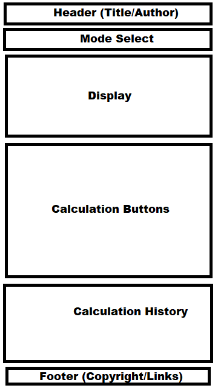
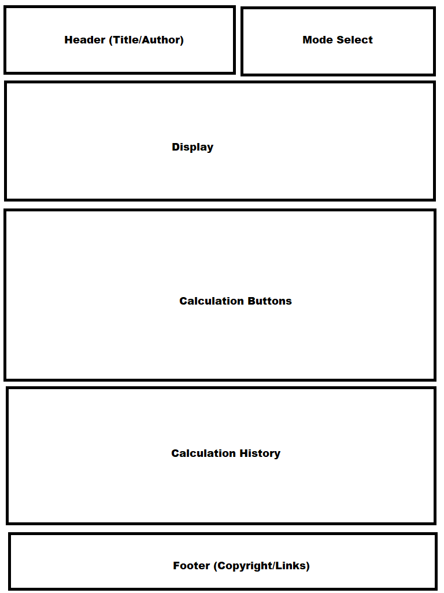
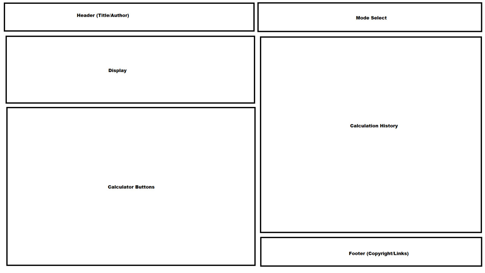
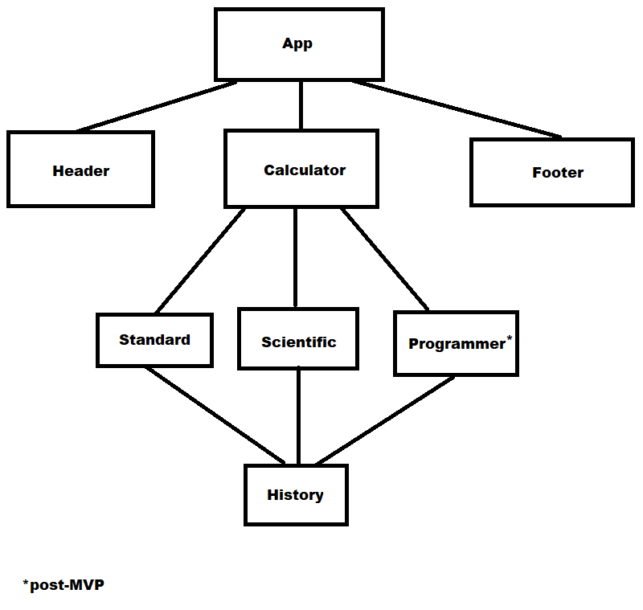

# General Assembly Project 2 - James Mernin

## Neato Calculator

## Project Description

Using a calculator API with common functionality stored in Airtable, this app will be designed to perform all types of calculations. There will be multiple modes, including standard, scientific, and (optionally) programming, and the history will keep track of all of your calculations.

## Wireframes

### Mobile (360x640)


### Tablet (768x1024)


### Desktop (1280x720)


## Component Hierarchy



## API and Data Sample

[Math.js API](https://api.mathjs.org/)

The following response is given when this GET request is made: `GET http://api.mathjs.org/v4/?expr=2%2F3&precision=3`

`0.667`

### React Router

The React router is going to be used to build each unique component. It will be used mainly to differentiate between the two (or three) calculator modes: Standard, Scientific, and (if I have time for post-MVP) Programmer. Each element will have its own calculator button layout and functionality to make API calls to Math.js in order to produce results.

### Airtable

Airtable is going to be used to record a calculation history that will display in its own unique window. The history will update after each completed calculation and will be able to be scrolled through and cleared out on command.

The Airtable component has been made and can be found here: https://airtable.com/tblDwEjnBHgBNRJ0D/viwUXb3QTQLa1BwEI

Airtable Example:
```
{
    "records": [
        {
            "id": "recZxkW7JXvcV7Mcd",
            "fields": {
                "id": 1,
                "calculation": "2 + 3",
                "result": "5"
            },
            "createdTime": "2020-10-09T17:06:31.000Z"
        },
        {
            "id": "recD1RkF6uGrxBQeD",
            "fields": {
                "id": 2
            },
            "createdTime": "2020-10-09T17:06:31.000Z"
        },
        {
            "id": "recspKOM10LckCol2",
            "fields": {
                "id": 3
            },
            "createdTime": "2020-10-09T17:06:31.000Z"
        }
    ],
    "offset": "recspKOM10LckCol2"
}
```

#### MVP 

- Have a standard view that does the same basic calculations as the Calculator app on Windows (add, subtract, multiply, divide, square, square root, inverse, percent)
- Have a scientific mode that processes more complex calculations (exponents, factorials, log and ln, absolute value, modulus)
- Add a history log that will store all calculations (use Airtable for this)

#### PostMVP  

- Have a programmer mode that processes comp sci calculations (bit shift, hexadecimal, octal, binary)
- Add a memory storage and recall system to save results

## Project Schedule

| Day | Deliverable | Status |
|---|---| ---|
| Oct 09 | Set up Airtable and API to make calls and store data. | Mostly complete |
| Oct 10 | Set up basic HTML and CSS and build the window, adjust for media queries. | Mostly complete |
| Oct 11 | Standard calculator mode! Get all of the standard calculations to produce. | Complete |
| Oct 12 | Scientific mode! Work on the scientific functions. | Complete |
| Oct 13 | Work on history functionality. | Mostly complete |
| Oct 14 | Finalize MVP to make sure project is presentable. | Mostly complete |
| Oct 15 | Work on memory and programmer mode. | Incomplete |
| Oct 16 | Present the project. | Incomplete |

## Timeframes

| Component | Priority | Estimated Time | Actual Time |
| --- | --- | --- | ---|
| Airtable and API | H | 3hrs | 2hrs |
| Structure Building | H | 4hrs | 5hrs |
| Standard Mode (HTML/CSS/JS) | H | 5hrs | 5hrs |
| Scientific Mode (HTML/CSS/JS) | H | 5hrs | 6hrs |
| History with Airtable | M | 5hrs | 3hrs |
| Testing and Cleanup | H | 5hrs | 2hrs |
| Memory | L | 3hrs | 0hrs |
| Programmer Mode (HTML/CSS/JS) | L | 5hrs | 0hrs |
| Total | H | 35hrs | 23hrs |

## SWOT Analysis

### Strengths:

Being able to make the code functional will be a strength of mine. My years of programming experience has me used to fixing issues as they come.

### Weaknesses:

CSS is still elusive to me, so I expect to spend a lot of time trying to get this to work. Making use of React functionality and Airtable may also prove challenging.

### Opportunities:

Being able to apply my ability to look up resources if I get stuck will help me get through the hard parts of my code.

### Threats:

My biggest threat is going to be making sure I am not wasting time getting stuck on silly errors and taking too long to try to resolve them.
